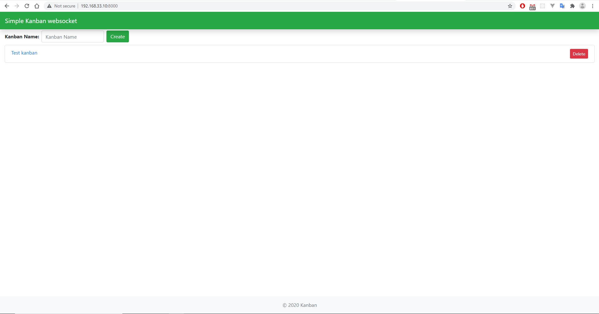
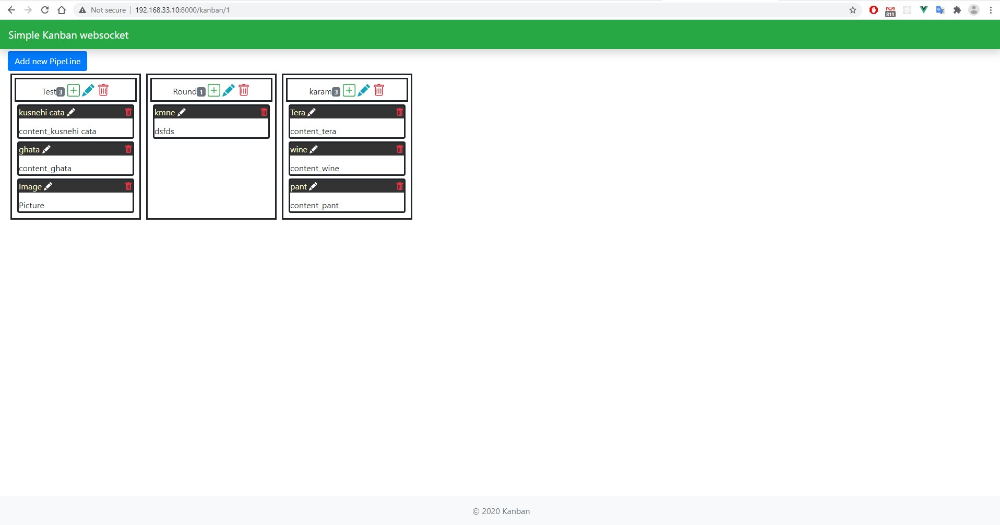
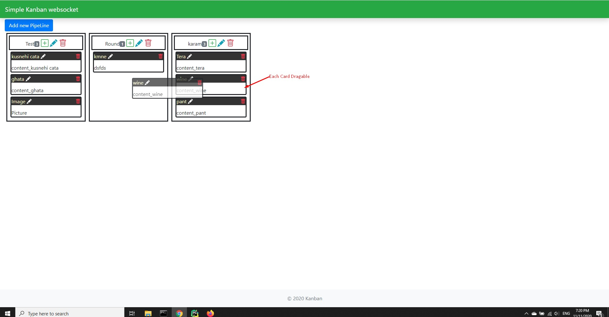

## Django-channels with vuex simple banner app





## Default setup
In your computer open terminal and create a project directory
```
mkdir tutorial
cd tutorial
```
Then clone the project
```
git clone https://github.com/arupratoncse/django-websocket-vuex.git
```
## Js setup
At first install node js then
install vue js in your computer globally
```
npm install -g @vue/cli
```
Now  install all package dependency
```
cd realtime/client
npm i
npm run serve  #for build project
npm run watch  #for watching mode
```
## Python setup
In tutorial directory
Create a virtual environment to isolate our package dependencies locally
```
python3 -m venv env
source env/bin/activate  # on windows use 'env\Scripts\activate'
```
The run the below command for installing web framework
```
pip install -r realtime/requirements.txt
```
##[N.B.] for channels-redis install redis-server in your machine[Ubuntu or Windows]
If an error occurs during installation, update the setuptools and pip versions as they may be out of date.
```
pip install -U pip setuptools
```
## Database migration
```
cd realtime
python manage.py migrate
```
create a superUser
```
python manage.py createsuperuser
```
##Collect static files
```
python manage.py collectstatic
```
##Run development server(I am using vagrant)
```
python manage.py runserver 0.0.0.0:8000
```
You can browse from a web browser at http://0.0.0.0:8000/
